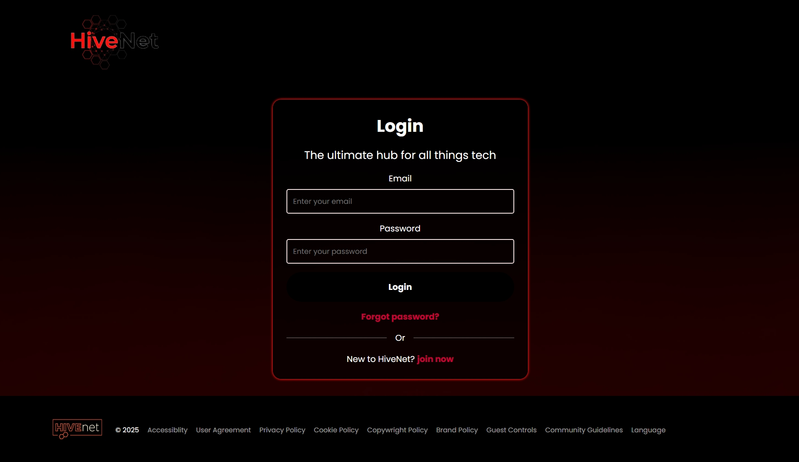

## HiveNet 🚀


Hivenet is an open networking platform built with a modern full-stack architecture.
The backend is powered by Spring Boot with MySQL, JWT authentication, and MailHog for email testing. The frontend uses React with Vite for a fast and responsive UI. The entire system runs in Docker for easy setup and deployment.


## Running the project on your machine

### Prerequisites

- Node.js (version 22 or compatible)  
- npm (version 10 or compatible)  
- Java JDK (version 21)  
- Docker (version 24.0.7 or compatible)  

---

### Backend Setup

Navigate to the backend directory:

```bash
cd backend
```
Run the docker containers:
```bash
docker-compose up
```

Build the backend (skip tests for faster build):
```bash
mvn clean install -DskipTests
```
Run the backend:
```bash
mvn spring-boot:run
```
---

## Frontend Setup

Navigate to the frontend directory:
```bash
cd frontend
```
Install dependencies:
```bash
npm install
```

Run the frontend in development mode:
```bash
npm run dev
```
## Access Points

Backend → http://localhost:8080

Frontend → http://localhost:5173

Mailhog (SMTP UI) → http://localhost:8025

Database connection details:

Host: 127.0.0.1

Port: 3306

Username: root

Password: root
